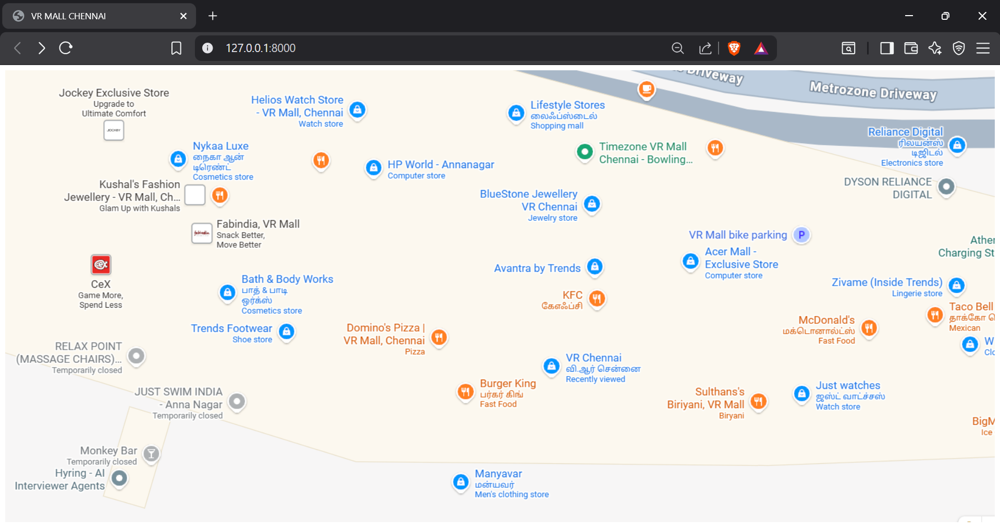
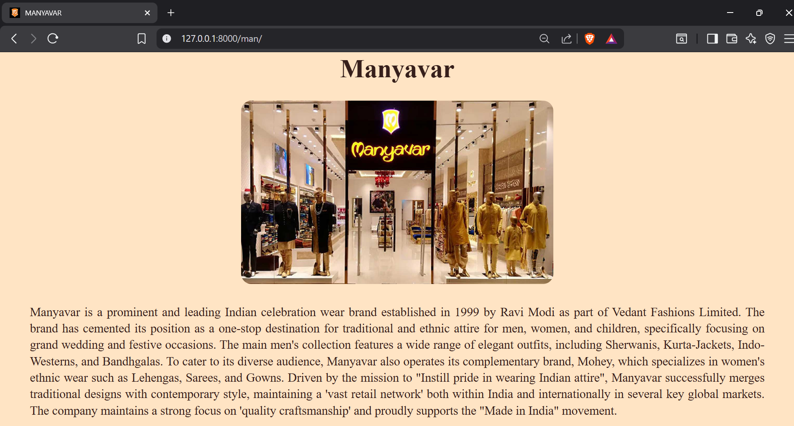
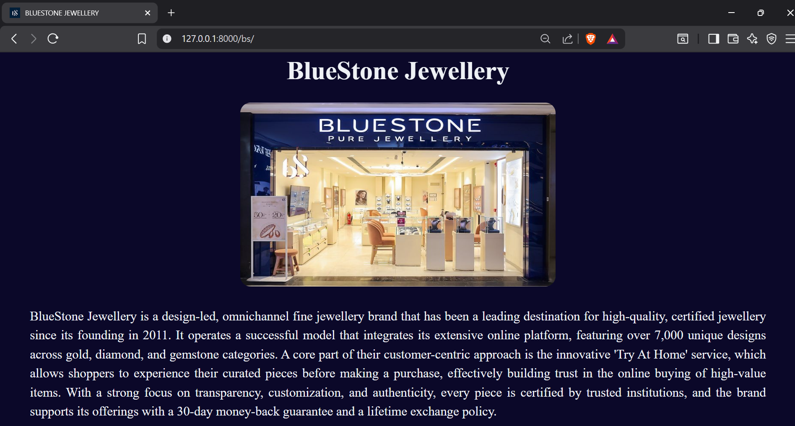
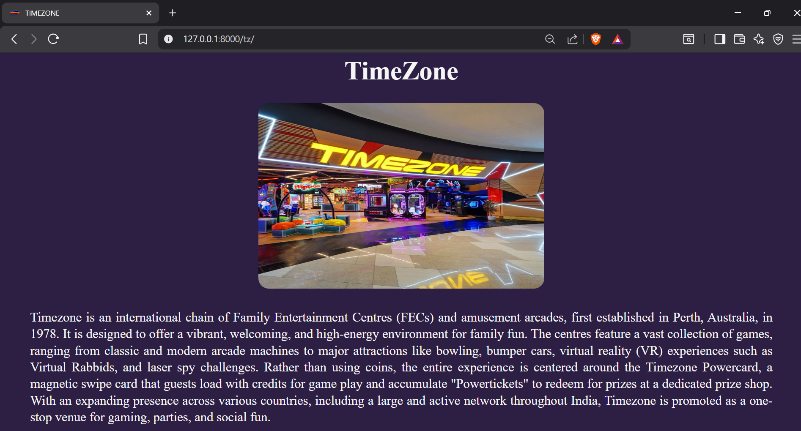

# Ex03 Places Around Me
# Date: 25.11.2025
# AIM
To develop a website to display details about the places around my house.

# DESIGN STEPS
## STEP 1
Create a Django admin interface.

## STEP 2
Download your city map from Google.

## STEP 3
Using <map> tag name the map.

## STEP 4
Create clickable regions in the image using <area> tag.

## STEP 5
Write HTML programs for all the regions identified.

## STEP 6
Execute the programs and publish them.

# CODE
urls.py
```
from django.contrib import admin
from django.urls import path
from imgmapapp import views

urlpatterns = [
    path('admin/', admin.site.urls),
    path('',views.imgmap),
    path('man/',views.manyavarclothing,name='man'),
    path('bs/',views.bs,name='bluestone'),
    path('mcd/',views.mcdonalds,name='mcd'),
    path('tz/',views.tz,name='timezone'),
]
```
views.py
```
from django.shortcuts import render
def imgmap(request):
    return render(request,'imagemap.html')
def manyavarclothing(request):
    return render(request,'manyavar.html')
def bs(request):
    return render(request,'bluestone.html')
def mcdonalds(request):
    return render(request,'mcd.html')
def tz(request):
    return render(request,'timezone.html')
```
design.css
```
h1{
    text-align: center;
    font-size: 50px;
}
img
{
    border-radius: 20px;
    display: block;
    margin-left: auto;
    margin-right: auto;
    width:auto;  
}
```
imagemap.html
```

<html lang="en">
<head>
    <title>VR MALL CHENNAI</title>  
</head>
<body>
    
    <map name="image-map">
        <area shape="rect" coords="854,671,685,616" title="Manyavar" href="">
        <area shape="rect" coords="732,178,936,238" title="BlueStone Jewellery" href="">
        <area shape="rect" coords="1204,371,1367,430" title="McDonald's" href="">    
        <area shape="rect" coords="887,102,1080,150" title="Timezone" href="">  
    </map>
</body>
</html>
```
manyavar.html
```

<html>
    <head>
        <title>MANYAVAR</title>
        <link rel="icon" href="">
        <link rel="stylesheet" href="">
        <style>
            p{
                text-align: justify;
                font-size: 24px;
                line-height: 32px;
                padding-top: 15px;
                padding-left: 50px;
                padding-right: 50px;
            }
        </style>
    </head> 
    <body style="background-color: bisque;color: #361f1b;">
        <h1>Manyavar</h1>
        
        <p>
            Manyavar is a prominent and leading Indian celebration wear brand established in 1999 by Ravi Modi as part of Vedant Fashions Limited. 
            The brand has cemented its position as a one-stop destination for traditional and ethnic attire for men, women, and children, 
            specifically focusing on grand wedding and festive occasions. The main men's collection features a wide range of elegant outfits, 
            including Sherwanis, Kurta-Jackets, Indo-Westerns, and Bandhgalas. To cater to its diverse audience, Manyavar also operates its 
            complementary brand, Mohey, which specializes in women's ethnic wear such as Lehengas, Sarees, and Gowns. Driven by the mission to 
            "Instill pride in wearing Indian attire", Manyavar successfully
             merges traditional designs with contemporary style, maintaining 
            a 'vast retail network' both within India and internationally in several key global markets. The company maintains a strong focus 
            on 'quality craftsmanship' and proudly supports the "Made in India" movement.
        </p>
    </body>
</html>
```
bluestone.html
```

<html>
    <head>
        <title>BLUESTONE JEWELLERY</title>
        <link rel="icon" href="">
        <link rel="stylesheet" href="">
        <style>
            p{
                text-align: justify;
                padding-top: 15px;
                padding-left: 50px;
                padding-right: 50px;
                line-height: 37px;
                font-size: 25px;
            }
            img{
                width: 40%;
            }
        </style>
    </head> 
    <body style="background-color:#0b0829;color: rgb(238, 241, 245);">
        <h1>BlueStone Jewellery</h1>
        
        <p>
            BlueStone Jewellery is a design-led, omnichannel fine jewellery brand that has been a leading destination for high-quality, 
            certified jewellery since its founding in 2011. It operates a successful model that integrates its extensive 
            online platform, featuring over 7,000 unique designs across gold, diamond, and gemstone categories. A core part of their customer-centric approach is the innovative 'Try At Home' service, 
            which allows shoppers to experience their curated pieces before making a purchase, effectively building trust in the online buying 
            of high-value items. With a strong focus on transparency, customization, and authenticity, every piece is certified by trusted institutions, 
            and the brand supports its offerings with a 30-day money-back guarantee and a lifetime exchange policy.
        </p>
    </body>
</html>
```
mcd.html
```

<html>
    <head>
        <title>McDONALD'S</title>
        <link rel="icon" href="">
        <link rel="stylesheet" href="">
        <style>
            p{
                text-align: justify;
                padding-top: 10px;
                padding-left: 50px;
                padding-right: 50px;
                line-height: 35px;
                font-size: 24px;
            }
        </style>
    </head> 
    <body style="background-color: #9a0002; color: #fdc825;">
        <h1>McDonald's</h1>
        
        <p>
            McDonald's Corporation is a global behemoth in the quick-service restaurant (QSR) industry, founded by the brothers Richard and Maurice McDonald in 1940 and later industrialized into 
            a massive franchise system by businessman Ray Kroc in the 1950s. The company's success is built upon its "Speedee Service System," emphasizing fast, affordable, and consistently high-quality 
            food, which primarily features its iconic hamburgers, world-famous French fries, and shakes. Its a vast network of franchisees, from whom it collects royalties and rent. McDonald's is constantly 
            innovating its menu with items like the McNuggets, and McCafé coffee line, while also adapting to local tastes and dietary trends globally with customized offerings. Through its core commitment 
            to convenience, value, and consistency, McDonald's continues to be one of the most powerful and recognizable brands in the world.
        </p>
    </body>
</html>
```
timezone.html
```

<html>
    <head>
        <title>TIMEZONE</title>
        <link rel="icon" href="">
        <link rel="stylesheet" href="">
        <style>
            p{
                text-align: justify;
                padding-top: 15px;
                padding-left: 50px;
                padding-right: 50px;
                line-height: 32px;
                font-size: 25px;
            }
            img
            {
                height:50%;
                width:36%;
            }

        </style>
    </head> 
    <body style="background-color: #2d1f44; color: whitesmoke;">
        <h1>TimeZone</h1>
        
        <p>
            Timezone is an international chain of Family Entertainment Centres (FECs) and amusement arcades, first established in Perth, Australia, in 1978. 
            It is designed to offer a vibrant, welcoming, and high-energy environment for 
            family fun. The centres feature a vast collection of games, ranging from classic and modern arcade machines to major attractions like bowling, 
            bumper cars, virtual reality (VR) experiences such as Virtual Rabbids, and laser spy challenges. Rather than 
            using coins, the entire experience is centered around the Timezone Powercard, a magnetic swipe card that guests load with credits for game play 
            and accumulate "Powertickets" to redeem for prizes at a dedicated prize shop. With an expanding presence across various countries, including 
            a large and active network throughout India, Timezone is promoted as a one-stop venue for gaming, parties, and social fun.
        </p>
    </body>
</html>
```
# OUTPUT







# RESULT
The program for implementing image maps using HTML is executed successfully.
